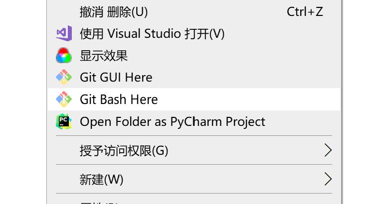

# 第一步：在 GitHub 平台中新建仓库

- **如果使用 Gitee** 在顶部导航条点击「+」>「新建仓库」，根据提示填写信息即可（暂不勾选给出的初始化选项）。
- **如果使用 GitHub** 在顶部导航条点击「+」>「New Repository」，根据提示填写信息即可（暂不勾选给出的初始化选项）。

然后填写仓库名称，其他全部保持默认就可以。
创建成功后，找到HTTPS码，将其复制


# 第二步：设置 Obsidian Git 插件进行后续的同步

[[基本用法#5.6 obsidian git]]

`Vault backup interval(minutes)`设置每几分钟同步一次

# 第三步：提交到Git

在要上传的库文件下新建一个`.gitignore`文件，在此文件中输入不想被提交的文件夹扩展名
如 `.obsidian （配置文件）和  .trash（回收站文件）`

在空白处右键单击，在弹出的快捷菜单中选择 `Git Bash Here`

依次输入以下命令
```
git init # 初始化仓库
git remote add origin <远程仓库地址>#将你的本地仓库与远程仓库建立连接。
git add --all #将所有文件添加到缓存区
git commit -m "提交信息"
git push -u origin master # 将你的提交推送到远程仓库中的`master`分支
```
出现以下提示，即上传成功


