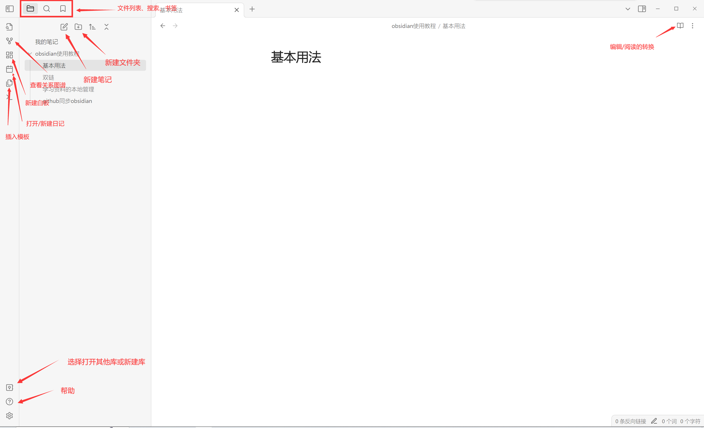
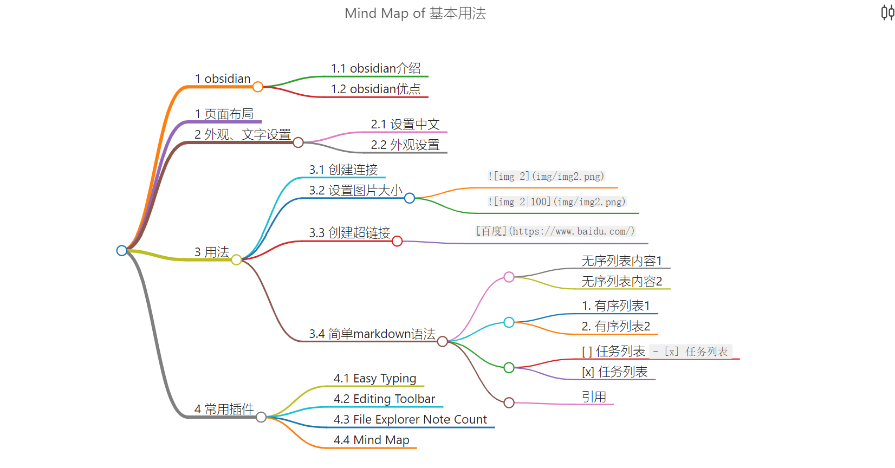

# 1 obsidian
## 1.1 obsidian介绍
**Obsidian**是一个使用[Markdown](https://zh.wikipedia.org/wiki/Markdown "Markdown")语法的闭源[笔记软件](https://zh.wikipedia.org/wiki/%E7%AC%94%E8%AE%B0%E8%BD%AF%E4%BB%B6 "笔记软件")。用户可以在笔记间建立双向链接，并且可以神经网络图的形式将这些链接可视化。该笔记旨在帮助用户以一种灵活的、非线性的方式来组织和构架他们的想法和知识。  
## 1.2 obsidian优点
1、个人使用完全免费;  
2、有大量的插件，可以根据个人喜好、习惯组装自己的个人平台；  
3、数据完全存储到本地，安全；  
4、支持 markdown 语法，而且所见即所得；  
5、使用插件后，可以将其他笔记软件嵌入到平台一起使用，方便快捷；  
6、支持双链。  
# 2 页面布局



# 3 外观、文字设置
## 3.1 设置中文

设置→setting→about→关于→语言→language→重新启动 

## 3.2 外观设置

设置→外观→基础颜色→明亮/黑暗
或是自定义主题,在社区中下载喜欢的主题

# 4 用法
## 4.1 创建连接
在  ==[[]]== 中  

  
例如：`[[#2.1 设置中文]]`

	[[#2.1 设置中文]]
## 4.2 设置图片大小
```

```


调整为100像素宽：

```

```


## 4.3 创建超链接

快捷键: Ctrl+K 出现右侧效果 `[]()` ，[]内自定义链接名称， （）填入本地文件路径或者网址都可以 ```

```
[百度](https://www.baidu.com/)
```
[百度](https://www.baidu.com/)
## 4.4 简单markdown语法

``==高亮==`` ==高亮==

---

``*斜体*``    *斜体*

---
``**加粗**``  **加粗**

---
``- 无序列表内容``
- 无序列表内容1
- 无序列表内容2
---
``1. 有序列表``
1. 有序列表1
2. 有序列表2
---
``- [ ] 任务列表``
- [ ] 任务列表
``- [x] 任务列表``
- [x] 任务列表
---
``> 引用``
> 引用
> 

---
# 5 常用插件
## 5.1  Commander
可以在编辑器的多处位置添加操作按钮来执行操作
## 5.2  Easy Typing
编写 markdown 时，自动格式化（例如：文本与英文间自动空格、公式之间自动空格）
输入 markdown 语法的英文格式时无需切换输入法
中文符号自动配对
## 5.3 Editing Toolbar

富文本编辑
## 5.4 File Explorer Note Count
统计文件夹中的文件数量
## 5.5 Mind Map
自动生成思维导图

## 5.6 obsidian git
有了这个插件，以后的同步操作你都可以在 Obsidian 内部进行了。

这个插件顶部的按钮对应了 Git 中最常见的几个操作。如果你对 Git 有一定的了解，应该对这些操作不会陌生。

1. Backup：备份，提交所有的更改，并且执行推送。
2. Commit：确认提交，但不推送。
3. Stage all：存储当前的变更。
4. Unstage all：取消存储变更。
5. Push：推送到远端，可以理解为推送到 Github。
6. Pull：从远端拉取到本地，可以理解为从 Github 拉取最新数据到本地。
7. Change Layout：改变下方文件的排布方式。
8. Refresh：刷新当前的文件变更情况。

如果你不想了解他们具体是干什么的，只想知道怎么做同步，那其实就两个按键有用：

1. Backup，第一个按钮，一次性完成提交并推送到 Github。
2. Pull，第六个按钮，从 Github 同步到本地。

到这一步就完成了所有的配置工作，第一次使用时，点击 Backup 就可以。


