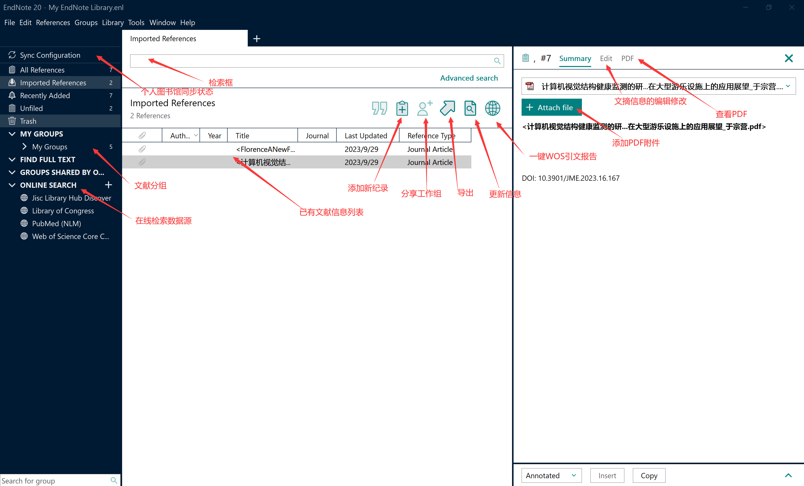
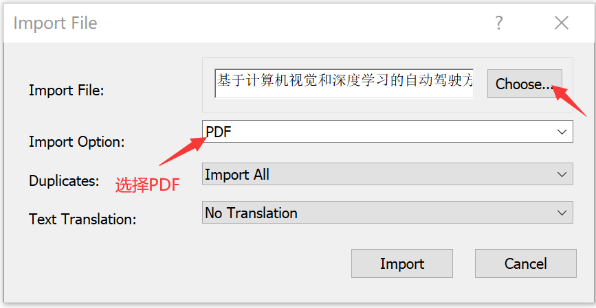

# 1 EndNote
**EndNote**是一种[文献管理软件](https://zh.wikipedia.org/wiki/%E6%96%87%E7%8C%AE%E7%AE%A1%E7%90%86%E8%BD%AF%E4%BB%B6 "文献管理软件")包。它可以用来创建个人参考文献库，管理目录及引用，并且可以加入文本、图像、表格和方程式等内容及链接，可以进行当地及远程检索。撰写文章时，可以方便地插入所引用文献并按照格式进行编排。
# 2页面布局

# 3 文献导入

## 3.1 本地PDF导入
File->import->file/folder

## 3.2 批量导入
## 3.2.1 导入英文文献
从web of science导入
从Google Scholar下载文献信息文件（文件后缀.enw）；
## 3.2.2 导入中文文献
从知网导入，知网导出文献信息txt即可

# 3.3 注意
1. 单独导入：操作在上文已提到，在获得一个文献的enw或txt之后导入，再在endnote附件区添加pdf；
2. 成批导入：成批导入有两种，一种是大家可以下载一堆enw或txt文件导入文献信息后，在线查询文献下载。但这种方法校外网络等都不能实现。另一种是将文献pdf以及文献信息enw或txt文件，文件名命名相同后全部放在一个文件夹中，直接在endnote里【File】-【Import】-【Import folder】即可，endnote会自动匹配。
# 4 分组管理
# 5 文献统计分析
# 6 参考文献排版
# 7 文献共享

