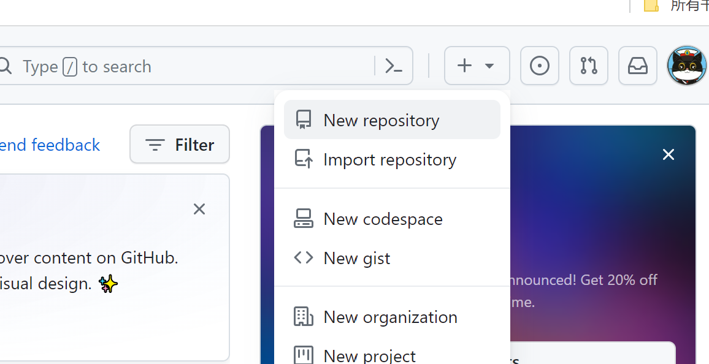
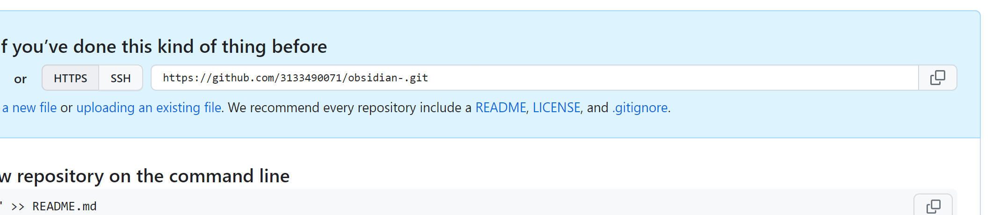
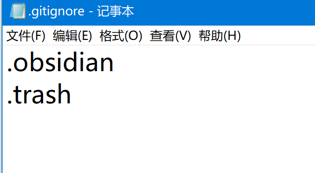
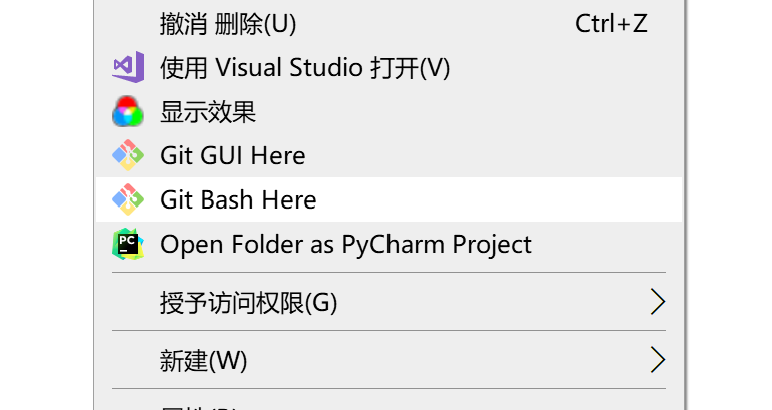

# 第一步：安装git
# 第二步：在 Git 托管平台中新建仓库

- **如果使用 Gitee** 在顶部导航条点击「+」>「新建仓库」，根据提示填写信息即可（暂不勾选给出的初始化选项）。
- **如果使用 GitHub** 在顶部导航条点击「+」>「New Repository」，根据提示填写信息即可（暂不勾选给出的初始化选项）。

然后填写仓库名称，其他全部保持默认就可以。
创建成功后，找到HTTPS码，将其复制


# 第三步：安装 Obsidian Git 插件进行后续的同步

获取gitee的url，通过复制即可。

接着，我们需要生成一个 SSH 密钥（SSH Key），用于在本地和远程 Git 仓库同步时验证身份。
在空白位置点击鼠标右键，选择 **Git Bash**（或者用你习惯的其他终端模拟器，如 Windows Terminal 等访问 Bash 亦可）：
在弹出的 Bash 窗口中，输入下面的命令**配置用户名**：

```
git config --global  user.name 你的用户名
```

以及用下面的命令**配置邮箱**：

```
git config --global user.email 你的邮箱
```

完成前两步后，可以用下面的命令检查**是否配置成功**：

```
git config --global  --list 
```
，如果返回的结果正确显示了你输入的用户名和邮箱

# 第四步：提交到Git

在要上传的库文件下新建一个`.gitignore`文件，在此文件中输入不想被提交的文件夹扩展名
如 `.obsidian （配置文件）和  .trash（回收站文件）`

在空白处右键单击，在弹出的快捷菜单中选择 `Git Bash Here`

依次输入以下命令
```
git init # 初始化仓库
git remote add origin <远程仓库地址>#链接仓库#将所有文件添加到缓存区
git commit -m“提交信息”
git push -u origin "master"# 推提交推送到gitee上git branch -m master # 将文件推送到gitee上
```


