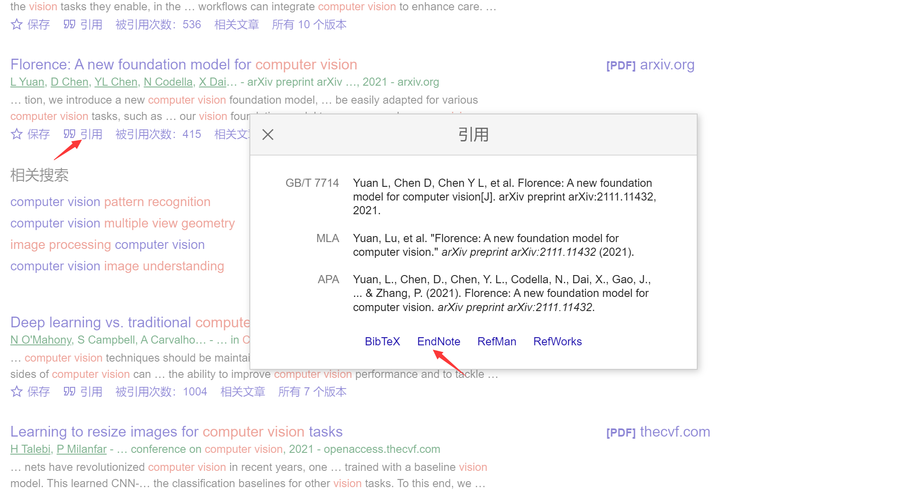
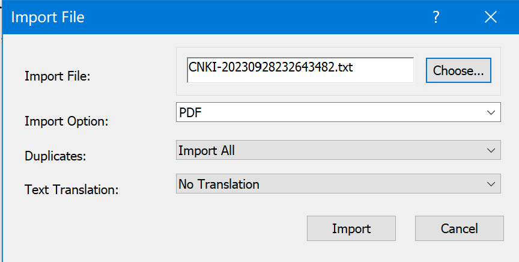
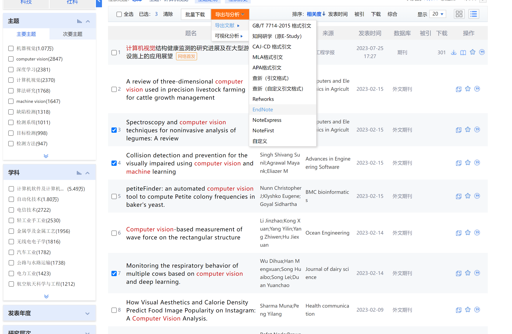
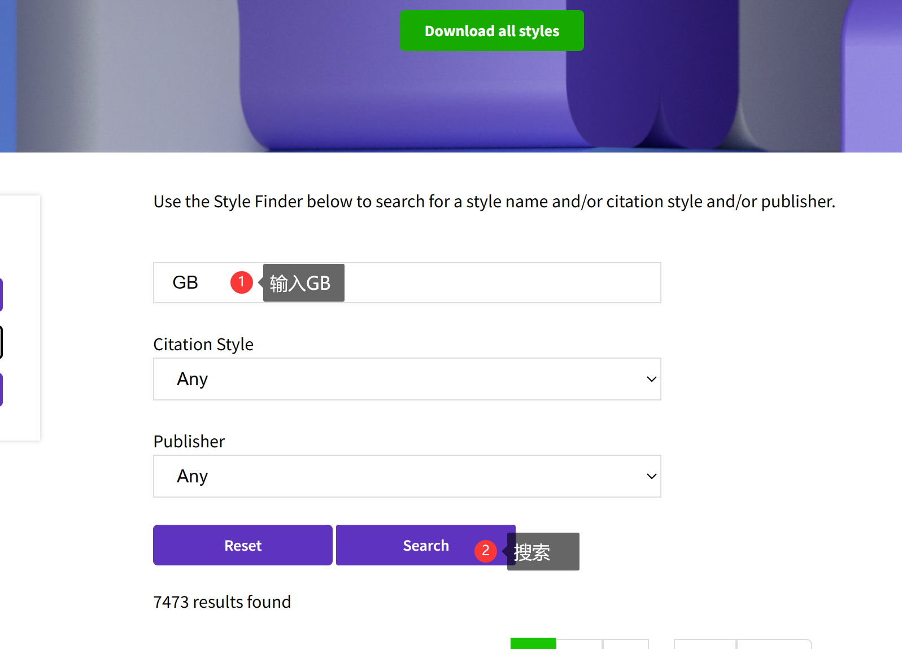
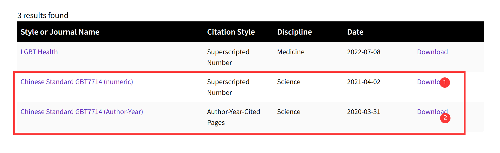
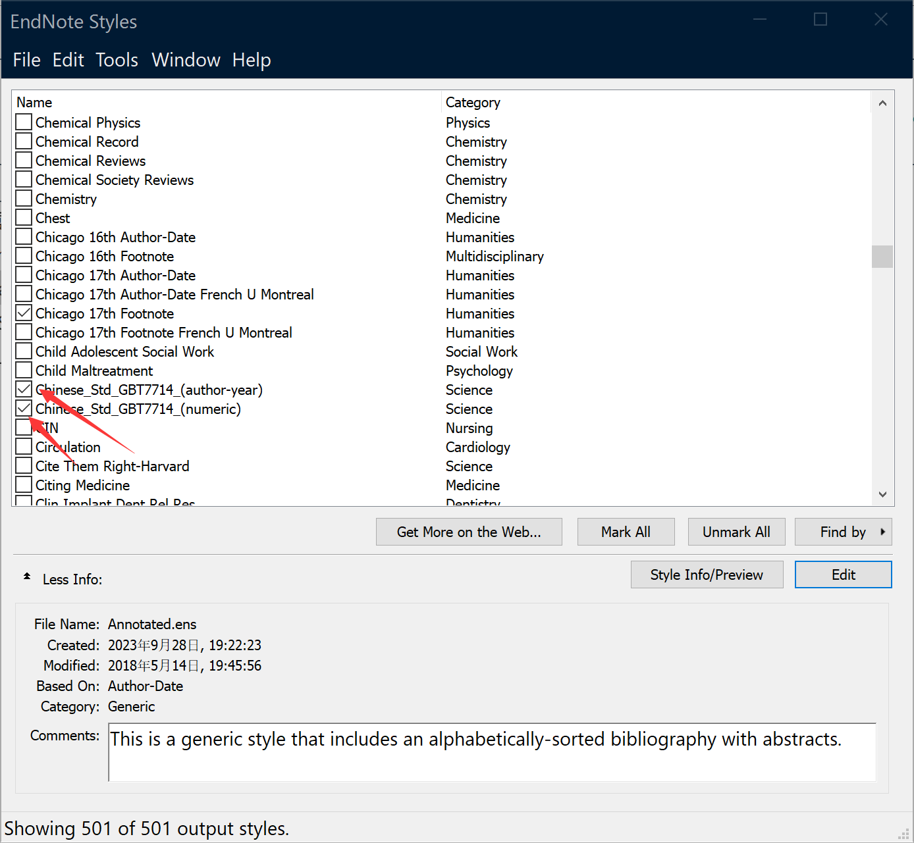
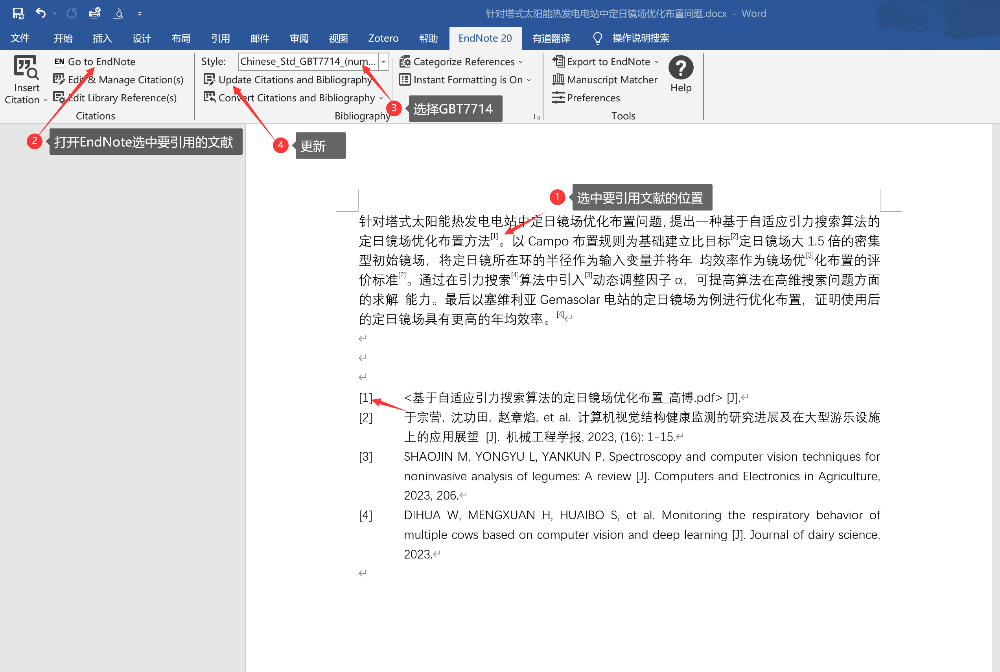

# 1 EndNote

**EndNote**是一种[文献管理软件](https://zh.wikipedia.org/wiki/%E6%96%87%E7%8C%AE%E7%AE%A1%E7%90%86%E8%BD%AF%E4%BB%B6 "文献管理软件")包。它可以用来创建个人参考文献库，管理目录及引用，并且可以加入文本、图像、表格和方程式等内容及链接，可以进行当地及远程检索。撰写文章时，可以方便地插入所引用文献并按照格式进行编排。
# 2页面布局

# 3 文献导入

## 3.1 本地PDF导入
File->import->file/folder

## 3.2 导入文献信息文件
###  导入英文文献
从Google Scholar下载文献信息文件（文件后缀.enw）；

###  导入中文文献
从知网导入，知网导出文献信息文件 （文件后缀.txt）；

在导入中文文献时，不建议导入pdf，因为endnote检索范围不包括中文，导入后信息有可能不全的，中文论文最好从中文数据库导入。
##  3.3注意
1. 单独导入：操作在上文已提到，在获得一个文献的enw或txt之后导入，再在endnote附件区添加pdf；
2. 成批导入：成批导入有两种，一种是大家可以下载一堆enw或txt文件导入文献信息后，在线查询文献下载。但这种方法校外网络等都不能实现。另一种是将文献pdf以及文献信息enw或txt文件，文件名命名相同后全部放在一个文件夹中，直接在endnote里【File】-【Import】-【Import folder】即可，endnote会自动匹配。
3. **没有下载PDF或者无法识别出作者等信息**
	复制文献的标题，然后点击打开谷歌学术（如果是中文的则打开中国知网）：点击引用
	最后在endnote中点击File->Import->File->Import File选择刚刚下载的文件，然后Import Option 选择EndNote Import 最后点击Import即可。
	如果是已经下载好了PDF，但是识别不出来，可以按照上面的步骤，然后再在EndNote找到刚刚导入的文件，点击添加附件即可

# 4 在Word中引用文献
[Output Styles | EndNote](https://endnote.com/downloads/styles/)
安装好EndNote之后会自动与Word建立关联，此处可能会因Word的版本不同而有所差异。  

- 第一步：同时打开EndNote和Word
- 第二步：在Wrod中将光标移动到文中需要添加参考文献的地方
- 第三步：在Word中EndNote选项中单击Go to EndNote,在EndNote中选中需要插入Word中的文献。(选中条目变色） 
**==注意==：参考文献根据不同的用途有不同的要求。
常用的是 国标2015(GB7714-2015)且 此格式在正文中的序号字体与原文一致 
需要手动添加  
进入官网下载 GBT7714 格式
[Output Styles | EndNote](https://endnote.com/downloads/styles/)

点击Download,下载并保存这两种样式。
Chinese Std GBT7714 (author-year).ens  
Chinese Std GBT7714 (numeric).ens  
找到EndNote安装目录下的Styles文件夹（我的是D:\EndNote\Styles），将上面两个文件拷贝进去。重新打开EndNote Styles对话框，勾选上刚刚导入的GBT7714,即可。  
接下来：点击菜单栏的Tools->Output Styles->Open Style Manager  

# 5 管理文献
